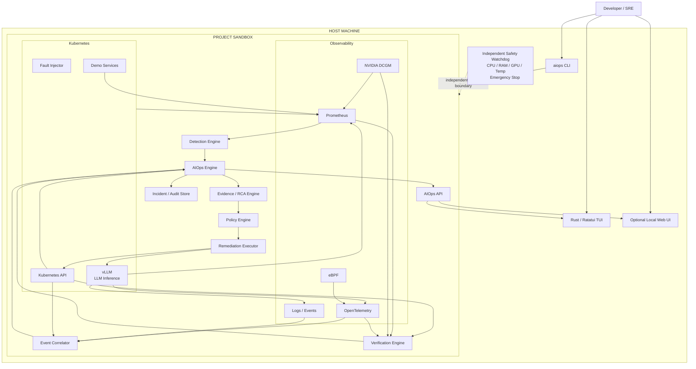

# PRD.md

# Autonomous AIOps for LLM Inference Infrastructure

**Status:** Implementation-ready
**Document role:** Single authoritative engineering specification
**Project type:** Open-source, local-first AIOps / Autonomous SRE platform
**Primary interface:** Interactive terminal UI (TUI)
**Secondary interface:** Local web/API control plane
**Target workloads:** Kubernetes-hosted LLM inference, initially vLLM
**Primary differentiator:** Evidence-backed, workload-aware diagnosis and safe remediation of LLM inference infrastructure failures

---

# 1. Executive Summary

This project is a **local-first autonomous AIOps control plane for LLM inference infrastructure**.

It observes a real Kubernetes environment running an inference workload, correlates telemetry from Kubernetes, Prometheus, OpenTelemetry, GPU telemetry, logs, and system-level signals, identifies incidents, determines likely root causes from observable evidence, proposes a safe remediation, executes only policy-approved actions, and verifies whether the infrastructure actually recovered.

The system must demonstrate a real closed loop:

```text
Fault
  ↓
Telemetry
  ↓
Detection
  ↓
Incident
  ↓
Evidence collection
  ↓
Root-cause analysis
  ↓
Remediation proposal
  ↓
Policy evaluation
  ↓
Controlled execution
  ↓
Infrastructure state change
  ↓
Verification
  ↓
Resolved / Rolled back
```

The project must **never simulate successful infrastructure actions while presenting them as real**.

Synthetic incidents are allowed, but they must be explicitly labeled as simulation.

The project is designed primarily as an engineering platform and demonstrator rather than a SaaS product.

---

# 2. Product Vision

Build an autonomous SRE system capable of answering:

> "Something is wrong with my LLM inference cluster. What happened, why did it happen, what evidence proves it, what can safely be changed, and did the change actually fix it?"

The system should move beyond generic Kubernetes monitoring by understanding **LLM inference-specific failure modes**.

Examples:

* GPU memory pressure
* CUDA OOM
* KV-cache pressure
* inference queue buildup
* rising P95/P99 latency
* throughput degradation
* GPU underutilization
* CPU/GPU imbalance
* model rollout regression
* unhealthy inference pods
* failed scheduling
* container restart loops
* resource exhaustion
* network/service degradation
* telemetry anomalies
* cascading failures

---

# 3. Problem Statement

Modern AI infrastructure combines:

* Kubernetes
* GPUs
* model servers
* distributed workloads
* high-throughput inference
* dynamic resource utilization
* observability systems
* model-specific metrics

Traditional monitoring usually identifies symptoms rather than producing an end-to-end operational response.

Generic AIOps systems also tend to focus on broad Kubernetes or infrastructure incidents.

This project focuses on the additional operational complexity introduced by **LLM inference workloads**.

The system must correlate:

```text
Infrastructure
    +
Kubernetes
    +
GPU
    +
Inference server
    +
Application
    +
Logs
    +
Metrics
    +
Events
```

into one evidence-backed incident model.

---

# 4. Goals

## 4.1 Primary Goals

The system SHALL:

1. Run locally.
2. Start only when explicitly requested.
3. Stop cleanly when explicitly requested.
4. Support CPU-only development.
5. Support optional real GPU execution.
6. Support Kubernetes.
7. Support vLLM or an equivalent inference server.
8. Collect real infrastructure telemetry.
9. Detect controlled failures.
10. Create structured incidents.
11. Correlate multiple evidence sources.
12. Produce evidence-backed RCA.
13. Propose safe remediation.
14. Enforce remediation policies.
15. Execute only allowlisted actions.
16. Verify infrastructure state after remediation.
17. Roll back when verification fails.
18. Maintain an immutable/auditable incident timeline.
19. Provide an interactive TUI.
20. Provide APIs usable by the TUI and future clients.
21. Provide automated E2E tests.
22. Protect the host machine from experimental workloads.
23. Clearly distinguish simulation from real infrastructure state.
24. Be reproducible from a clean development environment.

---

# 5. Non-Goals

The MVP SHALL NOT attempt to become:

* A generic Datadog replacement.
* A full observability platform.
* A general-purpose Kubernetes management system.
* A production multi-tenant SaaS.
* A fully autonomous unrestricted shell agent.
* An unrestricted infrastructure coding agent.
* A replacement for Prometheus.
* A replacement for Kubernetes.
* A replacement for vLLM.
* A generic GPU hardware fault-management platform.
* A system capable of arbitrarily modifying production infrastructure.
* A system requiring a large local LLM.
* A system that continuously runs in the background on the developer's machine.

The MVP SHALL NOT intentionally destabilize the host operating system.

---

# 6. Core Differentiation

The system is not merely:

```text
Kubernetes alert → LLM → answer
```

It is:

```text
LLM inference workload
        ↓
multi-layer telemetry
        ↓
correlated incident
        ↓
inference-aware diagnosis
        ↓
evidence-backed remediation
        ↓
policy-controlled execution
        ↓
observed verification
```

The primary technical differentiation is **LLM-inference-aware AIOps**.

The system should understand relationships such as:

```text
KV-cache pressure
      ↓
GPU memory pressure
      ↓
request queue growth
      ↓
latency increase
      ↓
timeouts
```

rather than treating each signal independently.

---

# 7. Prior-Art Boundary

The implementation MUST avoid becoming a thin reimplementation of existing projects.

The architecture should explicitly account for existing categories of systems such as:

* Kubernetes diagnostic systems
* Kubernetes autonomous remediation systems
* GPU health/fault-management systems
* eBPF-based observability systems
* generic AIOps platforms

The project should integrate or extend mature components where appropriate.

The project must add meaningful functionality at the **LLM inference workload layer**.

The following distinction should remain clear:

```text
Generic Kubernetes diagnosis
        ≠
LLM inference-aware operational diagnosis
```

and:

```text
GPU hardware/node recovery
        ≠
Inference workload-aware optimization/remediation
```

---

# 8. Primary User

The primary user is:

> A developer, ML engineer, platform engineer, or SRE running an LLM inference workload locally or in a small Kubernetes cluster.

The user should be able to start the entire environment and interact with it without manually operating every component.

---

# 9. Primary User Journey

## 9.1 Start

```bash
./aiops start --profile gpu
```

The system:

1. Checks prerequisites.
2. Runs safety checks.
3. Starts the sandbox.
4. Starts telemetry.
5. Starts the inference workload.
6. Starts the AIOps engine.
7. Starts the watchdog.
8. Starts the TUI.
9. Reports readiness.

---

# 10. Profiles

Three execution profiles SHALL exist.

## 10.1 `basic`

CPU-only.

Purpose:

* development
* CI
* unit/integration testing
* laptops without NVIDIA GPUs

Characteristics:

* Kubernetes sandbox
* deterministic inference/demo workload
* Prometheus
* AIOps engine
* fault injector
* TUI

No GPU dependency.

---

## 10.2 `gpu`

Real NVIDIA GPU.

Purpose:

* real GPU telemetry
* real inference
* real CUDA failures
* GPU-aware diagnosis

Components include:

* NVIDIA Container Toolkit
* DCGM exporter
* vLLM
* GPU telemetry
* bounded GPU fault injector

---

## 10.3 `demo`

Optimized for demonstrations.

Purpose:

```text
Start
↓
inject known incident
↓
watch system diagnose it
↓
approve remediation
↓
observe recovery
```

The demo profile must still use real infrastructure state.

The only difference is that the environment is preconfigured for deterministic reproduction.

---

# 11. Explicit Lifecycle Requirement

The project MUST NOT become a permanent background environment.

There must be no:

* automatic startup after reboot
* systemd service
* persistent Kubernetes daemon solely for this project
* Docker restart policy that keeps the project alive
* background agent that survives `stop`

Commands:

```bash
./aiops start
./aiops stop
./aiops restart
./aiops status
./aiops doctor
./aiops logs
./aiops tui
```

Optional:

```bash
./aiops start --profile basic
./aiops start --profile gpu
./aiops start --profile demo
```

---

# 12. Stop Contract

Running:

```bash
./aiops stop
```

MUST:

1. Stop the AIOps engine.
2. Stop the watchdog.
3. Stop the fault injector.
4. Stop inference workloads.
5. Stop project-owned containers.
6. Stop the Kubernetes sandbox if owned by the project.
7. Release GPU memory.
8. Release CPU/RAM resources.
9. Remove temporary resources where appropriate.
10. Leave prerequisites installed but inactive.

Acceptance condition:

```text
No project-owned workload remains running.
```

GPU memory should return close to the pre-run baseline within a configured timeout.

---

# 13. System Architecture

## 13.1 High-Level Architecture



---

# 14. Trust Boundaries

The architecture MUST treat the following as separate trust zones.

## Zone A — Host Safety

```text
Independent Watchdog
```

The watchdog must NOT depend on:

* the LLM
* the AIOps engine
* Kubernetes
* the TUI
* Prometheus

to perform emergency protection.

---

## Zone B — Infrastructure

```text
Kubernetes
vLLM
GPU
Demo workloads
```

---

## Zone C — Observability

```text
Prometheus
OpenTelemetry
DCGM
eBPF
Logs
Events
```

---

## Zone D — Intelligence

```text
Detection
Correlation
RCA
LLM reasoning
```

---

## Zone E — Control

```text
Policy
Remediation
Verification
Rollback
```

The LLM must never directly cross from Zone D into arbitrary infrastructure control.

---

# 15. Fundamental Design Rule

## The LLM is not the source of truth.

The source of truth is observable infrastructure state.

Therefore:

```text
LLM says "pod restarted"
```

is insufficient.

The system must verify:

```text
Kubernetes API:
pod UID changed

Kubernetes events:
restart observed

Metrics:
error rate recovered

Inference metrics:
latency recovered
```

Only then can the system report:

```text
Remediation verified
```

---

# 16. Evidence Model

Every significant system claim must reference evidence.

Evidence structure:

```json
{
  "evidence_id": "ev_123",
  "source": "prometheus",
  "timestamp": "2026-01-01T10:42:03Z",
  "resource": "vllm/inference-0",
  "metric": "gpu_memory_used_bytes",
  "query": "...",
  "value": 7340032000,
  "unit": "bytes",
  "relation": "supports",
  "incident_id": "inc_001"
}
```

Supported sources:

* Kubernetes API
* Kubernetes events
* Prometheus
* OpenTelemetry
* DCGM
* eBPF
* application logs
* inference metrics

---

# 17. Evidence Rules

The system MUST:

1. Record source.
2. Record timestamp.
3. Record resource.
4. Record the observation.
5. Preserve the original value.
6. Preserve the query or retrieval method where applicable.
7. Associate evidence with an incident.
8. Distinguish observed evidence from inferred conclusions.

The system MUST NOT fabricate evidence.

---

# 18. Incident Model

Incident schema:

```json
{
  "incident_id": "inc_001",
  "created_at": "...",
  "severity": "high",
  "mode": "GPU_REAL",
  "status": "DIAGNOSED",
  "service": "vllm",
  "resource": "deployment/vllm",
  "symptoms": [],
  "evidence": [],
  "root_cause": {},
  "remediation": {},
  "verification": {}
}
```

---

# 19. Incident State Machine

```text
DETECTED
   ↓
TRIAGING
   ↓
DIAGNOSED
   ↓
PROPOSED
   ↓
POLICY_CHECK
   ↓
APPROVED
   ↓
EXECUTING
   ↓
VERIFYING
   ↓
RESOLVED
```

Failure paths:

```text
DIAGNOSED → INSUFFICIENT_EVIDENCE

EXECUTING → EXECUTION_FAILED

VERIFYING → ROLLBACK_REQUIRED

ROLLBACK_REQUIRED → ROLLED_BACK

VERIFYING → UNRESOLVED

POLICY_CHECK → REJECTED        (operator rejects the proposal; audit: approval_denied)

EXECUTING → EXECUTION_FAILED   (also used when a restart interrupts an in-flight
                                remediation: the outcome was never verified, so the
                                incident is never marked RESOLVED)
```

The state transition must be persisted.

The UI must show the current state.

---

# 20. Incident Timeline

Every incident must produce a chronological timeline.

Example:

```text
10:41:52  GPU memory crossed threshold
10:41:54  Prometheus alert fired
10:41:55  Incident created
10:41:57  Investigation started
10:42:03  DCGM confirms GPU memory pressure
10:42:07  vLLM allocation failure observed
10:42:11  RCA generated
10:42:13  Remediation proposed
10:42:14  Policy check passed
10:42:18  Kubernetes patch executed
10:42:25  Deployment rollout observed
10:42:43  Metrics returned toward baseline
10:42:45  Incident verified
```

Timeline events must originate from actual system events.

---

# 21. Detection Engine

Detection must be deterministic wherever possible.

Initial detection mechanisms:

### 21.1 Threshold Detection

Examples:

```text
GPU memory > configured threshold
CPU > configured threshold
RAM > configured threshold
P95 latency > threshold
error rate > threshold
queue depth > threshold
pod restart count increasing
```

### 21.2 Rate-of-Change Detection

Example:

```text
latency increased by X% over Y seconds
```

### 21.3 Anomaly Detection

Optional MVP+ feature.

Use statistical methods before requiring an LLM.

Possible methods:

* rolling mean
* standard deviation
* EWMA
* z-score
* percentile deviation

---

# 22. Detection Requirements

Every detector must expose:

```text
detector_id
signal
threshold/configuration
observation
timestamp
severity
incident correlation key
```

Example:

```json
{
  "detector_id": "gpu_memory_pressure",
  "signal": "gpu_memory_used_bytes",
  "threshold": 7500000000,
  "observed": 7812345678,
  "severity": "high"
}
```

---

# 23. Event Correlation

The correlation engine must combine related signals.

Example:

```text
GPU memory increase
+
KV cache increase
+
request queue increase
+
latency increase
+
CUDA allocation failure
```

should produce one correlated incident rather than five unrelated incidents.

Correlation keys may include:

* Kubernetes namespace
* pod
* deployment
* node
* GPU UUID
* service
* model
* time window

---

# 24. LLM Inference-Aware Correlation

The system should understand relationships between:

```text
requests
↓
batching
↓
KV cache
↓
GPU memory
↓
latency
↓
throughput
```

and:

```text
deployment
↓
pod scheduling
↓
GPU allocation
↓
model loading
↓
inference readiness
```

---

# 25. Root-Cause Analysis

RCA is an evidence synthesis system.

It is NOT an unrestricted reasoning agent.

RCA pipeline:

```text
Incident
 ↓
Collect relevant evidence
 ↓
Normalize
 ↓
Rank evidence
 ↓
Generate candidate causes
 ↓
Check candidates against evidence
 ↓
Reject unsupported candidates
 ↓
Produce structured RCA
```

---

# 26. RCA Output Contract

```json
{
  "root_cause": {
    "category": "GPU_MEMORY_PRESSURE",
    "statement": "Inference workload exhausted available GPU memory.",
    "confidence": 0.91
  },
  "evidence_ids": [
    "ev_001",
    "ev_002",
    "ev_003"
  ],
  "alternative_causes": [],
  "insufficient_evidence": false
}
```

The system MUST allow:

```json
{
  "insufficient_evidence": true
}
```

when evidence does not support a conclusion.

The system must prefer uncertainty over fabricated certainty.

---

# 27. LLM Usage Rules

The LLM may:

* summarize evidence
* generate RCA explanations
* identify relationships
* propose remediation from an allowlisted catalog
* generate human-readable incident reports

The LLM may NOT:

* execute arbitrary shell commands
* generate unrestricted Kubernetes commands
* bypass policy
* directly mutate infrastructure
* decide whether safety limits may be ignored
* claim verification without verification evidence

---

# 28. Structured LLM Output

All LLM outputs must use schema validation.

Invalid output:

```text
free-form natural language
```

must not enter the control pipeline.

Expected:

```json
{
  "cause_category": "...",
  "evidence_ids": [],
  "remediation_id": "...",
  "reason": "..."
}
```

---

# 29. Remediation Catalog

The system must use predefined remediation functions.

Initial catalog:

```text
restart_pod
restart_deployment
rollback_deployment
scale_replicas
reduce_batch_size
reduce_max_num_seqs
adjust_inference_resource
cordon_node
pause_fault_injection
restore_previous_configuration
```

The actual available actions depend on profile and environment.

---

# 30. No Arbitrary Shell Rule

This is a hard security requirement.

The remediation engine MUST NOT support:

```text
LLM → shell command → execute
```

Instead:

```text
LLM
 ↓
Typed remediation proposal
 ↓
Policy
 ↓
Allowlisted executor
 ↓
Infrastructure
```

Example:

```json
{
  "action": "scale_replicas",
  "parameters": {
    "deployment": "vllm",
    "replicas": 2
  }
}
```

---

# 31. Policy Engine

OPA should be used where practical.

Policy evaluation should consider:

* action type
* environment
* resource
* current state
* risk level
* cooldown
* maximum frequency
* rollback availability
* user approval requirement

Example:

```text
restart pod:
    allowed

scale deployment:
    requires approval

rollback deployment:
    requires approval

cordon node:
    requires explicit approval

arbitrary command:
    denied
```

---

# 32. Approval Model

Remediations have three modes:

```text
AUTO
APPROVAL_REQUIRED
DENIED
```

The default development mode should be:

```text
APPROVAL_REQUIRED
```

for infrastructure-changing actions.

The TUI must allow:

```text
Approve
Reject
Inspect
```

---

# 33. Remediation Contract

Every remediation must define:

```json
{
  "remediation_id": "rem_001",
  "action": "restart_pod",
  "target": "vllm-0",
  "risk": "medium",
  "preconditions": [],
  "expected_effect": [],
  "rollback": {},
  "timeout_seconds": 60
}
```

---

# 34. Precondition Checks

Before execution:

```text
Does target exist?
Is target still in the expected state?
Is this incident still active?
Has another remediation already modified it?
Is the action allowed?
Is rollback available?
Is the safety budget healthy?
```

If any critical precondition fails:

```text
DO NOT EXECUTE
```

---

# 35. Verification Engine

Remediation is NOT successful merely because an API call succeeded.

Verification must inspect actual infrastructure.

Example:

```text
Action:
restart pod

Verification:
pod UID changed
pod becomes Ready
error rate decreases
latency returns toward baseline
```

---

# 36. Verification Contract

```json
{
  "remediation_id": "rem_001",
  "checks": [
    {
      "name": "pod_ready",
      "expected": true,
      "observed": true
    },
    {
      "name": "error_rate",
      "expected": "< baseline + tolerance",
      "observed": true
    }
  ],
  "result": "VERIFIED"
}
```

---

# 37. Rollback

Every reversible action must define a rollback.

Example:

```text
scale replicas
    ↓
verification fails
    ↓
restore previous replica count
```

Rollback must itself be observable and verified.

---

# 38. Verification Failure

If remediation does not produce expected results:

```text
VERIFYING
    ↓
ROLLBACK_REQUIRED
    ↓
ROLLBACK
    ↓
VERIFY_ROLLBACK
    ↓
ROLLED_BACK
```

The system must never silently mark the incident resolved.

---

# 39. Fault Injection

Fault injection is essential to proving the architecture.

The system must support controlled failures.

Initial fault classes:

### Kubernetes

* pod crash
* pod restart
* readiness failure
* deployment misconfiguration
* resource pressure
* scheduling failure

### Inference

* latency spike
* queue buildup
* request failure
* model server restart
* model load failure

### GPU

* controlled GPU memory pressure
* CUDA allocation failure
* GPU utilization spike

### Network

* service latency
* controlled request failure

---

# 40. Real GPU OOM Safety

The project MUST NOT intentionally exhaust the entire host GPU without bounds.

A GPU stressor must:

1. Have a configured memory budget.
2. Have a timeout.
3. Run in a dedicated child process/container.
4. Catch expected CUDA allocation failures.
5. Stop cleanly.
6. Be monitored by the independent watchdog.
7. Abort immediately if safety thresholds are exceeded.

The goal is:

```text
real application-level GPU allocation failure
```

not:

```text
crash the developer's machine
```

---

# 41. Fault Injection Modes

## Simulation

No actual infrastructure damage.

Used for:

* CI
* deterministic tests
* development

UI badge:

```text
SIMULATION
```

---

## Local Real

Actual sandbox infrastructure is modified.

UI badge:

```text
LOCAL-REAL
```

---

## GPU Real

Actual GPU workload is affected within safety limits.

UI badge:

```text
GPU-REAL
```

The mode must always be visible.

---

# 42. Host Safety Watchdog

The watchdog is an independent process.

It monitors:

```text
CPU utilization
RAM utilization
GPU utilization
GPU memory
GPU temperature
disk space
test duration
fault-injection status
```

It must not rely on:

* LLM
* AIOps engine
* Kubernetes
* Prometheus
* TUI

for emergency shutdown.

---

# 43. Watchdog Actions

If a safety threshold is exceeded:

```text
STOP FAULT INJECTION
        ↓
STOP EXPERIMENTAL WORKLOAD
        ↓
REQUEST SANDBOX SHUTDOWN
        ↓
COLLECT DIAGNOSTICS
        ↓
MARK TEST ABORTED
```

The watchdog must fail closed.

---

# 44. Safety Configuration

Example development defaults:

```yaml
safety:
  max_cpu_percent: 90
  max_ram_percent: 90
  max_gpu_percent: 90
  max_gpu_memory_percent: 85
  max_temperature_celsius: configurable
  min_free_disk_gb: 20
  max_test_duration_seconds: 300
```

These are configurable defaults, not universal hardware-safe guarantees.

The system must allow calibration against the actual machine.

---

# 45. Resource Budgets

## Minimum CPU-only environment

```text
CPU: 4 cores
RAM: 8 GB
Disk: 30 GB
GPU: none
```

## Recommended

```text
CPU: 8 cores
RAM: 16 GB
Disk: 50–80 GB
GPU: optional
```

## GPU development

Recommended:

```text
NVIDIA GPU
8 GB+ VRAM
16 GB+ system RAM
```

The inference model must be selected based on available VRAM.

The system must not assume a specific model is universally safe.

---

# 46. Resource Budget Enforcement

The project must define explicit budgets for:

```text
AIOps engine
observability stack
inference workload
fault injector
TUI
```

The `doctor` command must report:

```text
Host capacity
Configured budget
Current usage
Available headroom
```

---

# 47. TUI

The TUI is the primary operator interface.

Technology:

```text
Rust
Ratatui
```

The TUI must be functional, not merely decorative.

---

# 48. TUI Main Screen

Conceptual layout:

```text
┌──────────────────────────────────────────────────────────────┐
│ AIOPS CONTROL PLANE                         GPU-REAL ●       │
│ CPU 41%   RAM 54%   GPU 63%   VRAM 71%   HEALTHY           │
├──────────────────────────────────────────────────────────────┤
│ INFERENCE                                                   │
│ Requests/min     ████████████     142                       │
│ P95 latency      ███████          184 ms                    │
│ Throughput       █████████        91 tok/s                  │
│ KV Cache         ███████████      72%                       │
├──────────────────────────────────────────────────────────────┤
│ INCIDENTS                                                   │
│ ● INC-001  GPU memory pressure       DIAGNOSED             │
│ ● INC-002  Latency anomaly           RESOLVED              │
├──────────────────────────────────────────────────────────────┤
│ RECENT EVENTS                                                │
│ 10:42:03 GPU memory threshold crossed                       │
│ 10:42:07 CUDA allocation failure                            │
│ 10:42:11 RCA generated                                      │
│ 10:42:13 Remediation awaiting approval                      │
├──────────────────────────────────────────────────────────────┤
│ ↑↓ Navigate  ENTER Inspect  R Remediate  I Inject          │
│ M Metrics  L Logs  T Timeline  ? Help  Q Quit              │
└──────────────────────────────────────────────────────────────┘
```

---

# 49. TUI Screens

Required:

1. Dashboard
2. Incident list
3. Incident detail
4. Evidence
5. Timeline
6. RCA
7. Remediation
8. Fault injection
9. System status
10. Logs
11. Metrics
12. Help

---

# 50. TUI Navigation

Required controls:

```text
↑ ↓
Enter
Esc
Tab
q
r
a
d
i
l
m
t
p
s
?
```

Dangerous actions require confirmation.

Example:

```text
Approve remediation?

[Restart deployment/vllm]

Risk: MEDIUM
Rollback: AVAILABLE

Press ENTER to approve
Press ESC to cancel
```

---

# 51. TUI Evidence Screen

Must show:

```text
Incident
↓
Evidence
↓
Source
↓
Observed value
↓
Timestamp
↓
Relationship to RCA
```

Example:

```text
EVIDENCE #003

Source:
Prometheus

Metric:
gpu_memory_used_bytes

Observed:
7.81 GiB

Threshold:
7.50 GiB

Timestamp:
10:42:03

Supports:
GPU_MEMORY_PRESSURE
```

---

# 52. TUI Remediation Screen

Must show:

```text
ACTION
Restart vLLM deployment

WHY
Inference pod has repeated CUDA allocation failures.

EVIDENCE
#003 GPU memory pressure
#004 CUDA allocation failure
#005 pod restart loop

RISK
MEDIUM

ROLLBACK
AVAILABLE

POLICY
APPROVAL_REQUIRED
```

Buttons:

```text
[Approve]
[Reject]
[Inspect Evidence]
```

---

# 53. TUI Requirements

The TUI must:

* work over SSH
* work in terminals approximately 120×30 or larger
* degrade gracefully on smaller terminals
* not require a browser
* update live
* support keyboard-only operation
* never display stale state without indicating staleness
* visibly distinguish simulation and real modes
* never claim remediation success without verification

---

# 54. Web UI

The web UI is secondary.

It should provide deeper inspection for:

* historical incidents
* timelines
* evidence
* metrics
* RCA
* remediation history

The web UI must use the same API as the TUI.

The TUI and web UI must not implement separate business logic.

---

# 55. API Architecture

The AIOps API is the central control interface.

Initial endpoints:

```text
GET  /health

GET  /api/v1/status

GET  /api/v1/incidents

GET  /api/v1/incidents/{id}

GET  /api/v1/incidents/{id}/timeline

GET  /api/v1/incidents/{id}/evidence

GET  /api/v1/incidents/{id}/rca

GET  /api/v1/incidents/{id}/remediation

POST /api/v1/incidents/{id}/remediation/approve

POST /api/v1/incidents/{id}/remediation/reject

POST /api/v1/faults

GET  /api/v1/faults

POST /api/v1/control/start

POST /api/v1/control/stop
```

---

# 56. Live Event Transport

The system should support:

```text
Server-Sent Events
```

or:

```text
WebSocket
```

for live TUI/web updates.

Events:

```text
incident.created
incident.updated
evidence.added
rca.completed
remediation.proposed
remediation.approved
remediation.started
remediation.completed
verification.started
verification.completed
watchdog.warning
watchdog.abort
```

---

# 57. Event Contract

Example:

```json
{
  "event_id": "evt_123",
  "type": "incident.created",
  "timestamp": "...",
  "incident_id": "inc_001",
  "payload": {}
}
```

Events must be versionable.

---

# 58. Persistence

The MVP may use:

```text
SQLite
```

for:

* incidents
* evidence metadata
* remediation records
* verification results
* audit events

Telemetry itself should remain in its native systems.

Do not copy all Prometheus data into the incident database.

---

# 59. Audit Log

All control-plane actions must be auditable.

Minimum events:

```text
fault_injected
incident_created
rca_generated
remediation_proposed
policy_evaluated
approval_granted
approval_denied
remediation_started
remediation_finished
verification_started
verification_finished
rollback_started
rollback_finished
watchdog_abort
```

---

# 60. Audit Integrity

Audit events should form a hash chain:

```text
event_1
  hash_1
    ↓
event_2
  hash_2
    ↓
event_3
```

This is intended to make accidental or unauthorized modification detectable.

It is not intended to provide cryptographic security against a fully compromised host.

---

# 61. Observability Stack

Core:

```text
Prometheus
OpenTelemetry
```

GPU profile:

```text
NVIDIA DCGM
```

Optional:

```text
Loki
Tempo
```

System-level:

```text
eBPF
```

The MVP should avoid introducing every observability technology simultaneously.

---

# 62. MVP Telemetry

Minimum required:

### Kubernetes

* pod state
* deployment state
* restart count
* readiness
* scheduling events

### Inference

* request count
* request errors
* latency
* throughput
* queue depth
* model readiness

### GPU

* utilization
* memory used
* memory total
* temperature

---

# 63. LLM Inference Metrics

Where available:

```text
request rate
request latency
P50
P95
P99
tokens/sec
queue depth
batch size
KV cache utilization
running requests
waiting requests
error rate
```

Metric availability varies by inference server/version.

The telemetry adapter must gracefully handle missing metrics.

---

# 64. Adapter Architecture

Telemetry must use adapters.

```text
PrometheusAdapter
KubernetesAdapter
DCGMAdapter
OpenTelemetryAdapter
LogAdapter
```

The RCA engine should not directly depend on Prometheus implementation details.

---

# 65. Inference Provider Interface

Define:

```python
class InferenceProvider:
    def health(self): ...
    def metrics(self): ...
    def configuration(self): ...
    def apply_safe_configuration(self, change): ...
    def rollback_configuration(self, change): ...
```

vLLM is the first implementation.

Future providers may include:

```text
Triton
TensorRT-LLM
llama.cpp
Ollama
```

---

# 66. Kubernetes Provider Interface

Define operations:

```text
get_pod
get_deployment
get_events
restart_pod
restart_deployment
scale_deployment
rollback_deployment
cordon_node
```

Each operation must return structured results.

---

# 67. No Hidden Infrastructure Operations

Every infrastructure mutation must emit:

```text
operation_id
actor
action
target
parameters
timestamp
policy_decision
result
```

---

# 68. Safety Actor Model

Actions should identify the actor:

```text
USER
AIOPS_AUTO
AIOPS_APPROVED
WATCHDOG
TEST
FAULT_INJECTOR
```

This makes audit interpretation explicit.

---

# 69. Fault Injection API

Example:

```json
POST /api/v1/faults
{
  "type": "gpu_memory_pressure",
  "target": "vllm-0",
  "duration_seconds": 30,
  "budget": {
    "max_gpu_memory_percent": 80
  }
}
```

The API must reject:

* unknown fault types
* invalid targets
* unsafe budgets
* missing timeouts

---

# 70. Controlled GPU Fault Flow

Example:

```text
User presses I
        ↓
Select GPU memory pressure
        ↓
Select target
        ↓
System checks safety budget
        ↓
User confirms
        ↓
Fault injector starts
        ↓
Watchdog monitors
        ↓
GPU pressure rises
        ↓
vLLM experiences controlled allocation failure
        ↓
Fault injector exits/cleans up
        ↓
AIOps detects incident
```

---

# 71. End-to-End Golden Scenario

The MVP is not complete until this scenario works.

## Scenario

```text
vLLM running
        ↓
Inject controlled GPU memory pressure
        ↓
GPU memory increases
        ↓
Inference allocation fails
        ↓
Pod becomes unhealthy/restarts
        ↓
Prometheus observes anomaly
        ↓
Incident created
        ↓
Evidence collected
        ↓
RCA identifies GPU memory pressure
        ↓
Remediation proposed
        ↓
Policy requires approval
        ↓
User approves
        ↓
Safe remediation executes
        ↓
Kubernetes state changes
        ↓
Inference becomes healthy
        ↓
Latency/error metrics recover
        ↓
Verification succeeds
        ↓
Incident RESOLVED
```

Every stage must be observable.

---

# 72. Golden Scenario Acceptance Criteria

The E2E test must assert:

```text
incident_created == true

evidence_count >= 2

root_cause_present == true

root_cause_has_evidence == true

remediation_proposed == true

policy_decision_recorded == true

remediation_executed == true

infrastructure_state_changed == true

verification_started == true

verification_passed == true

incident_state == RESOLVED
```

---

# 73. Anti-Fake Acceptance Rule

The following implementation is invalid:

```python
incident.status = "RESOLVED"
```

without checking infrastructure.

Likewise invalid:

```python
remediation.status = "SUCCESS"
```

because an executor returned HTTP 200.

The system must verify actual state.

---

# 74. Example Verification

For a deployment restart:

```text
Before:
pod UID = abc

Action:
restart deployment

After:
pod UID = xyz

Then:
Ready = true
error rate < threshold
latency within recovery tolerance
```

Only then:

```text
VERIFIED
```

---

# 75. Unknown Incident Behavior

If the system cannot determine a root cause:

```text
INCIDENT
↓
INSUFFICIENT_EVIDENCE
```

It must show:

```text
Insufficient evidence to safely determine root cause.
```

It must NOT hallucinate a cause.

---

# 76. Security Requirements

The project must assume the LLM can produce incorrect or malicious output.

Controls:

* structured outputs
* schema validation
* allowlisted actions
* policy engine
* approval gates
* resource limits
* timeout
* audit logs
* no arbitrary shell
* no unrestricted Kubernetes API access
* least privilege service accounts

---

# 77. Kubernetes Permissions

The AIOps service account must have only required permissions.

Development permissions may include:

```text
get/list/watch pods
get/list/watch deployments
get/list/watch events
patch approved resources
```

Dangerous cluster-wide privileges should be avoided.

---

# 78. Secret Management

The project must not store:

* API keys
* cloud credentials
* Kubernetes admin credentials

inside source control.

Use environment variables or local secret mechanisms.

---

# 79. AI Provider Abstraction

The RCA engine must support:

```text
LOCAL
API
DISABLED
```

Example:

```yaml
llm:
  provider: local
  model: configured-at-runtime
```

The system must remain functional for deterministic incidents without requiring an LLM.

---

# 80. Deterministic Fallback

If the LLM is unavailable:

```text
Detection
    ↓
Rule-based RCA
    ↓
Allowlisted remediation
    ↓
Verification
```

must still work for known incident classes.

This is important for:

* CI
* offline usage
* reproducibility
* debugging

---

# 81. Configuration

Configuration should be centralized.

Example:

```yaml
project:
  mode: gpu

safety:
  max_cpu_percent: 90
  max_ram_percent: 90
  max_gpu_memory_percent: 85

detection:
  gpu_memory_threshold: configurable
  latency_threshold_ms: configurable

remediation:
  approval_mode: approval_required

llm:
  provider: local

storage:
  type: sqlite
```

Secrets must not be stored here.

---

# 82. CLI Contract

## Start

```bash
./aiops start --profile basic
```

## Stop

```bash
./aiops stop
```

## Status

```bash
./aiops status
```

## Doctor

```bash
./aiops doctor
```

## Logs

```bash
./aiops logs
```

## TUI

```bash
./aiops tui
```

## Restart

```bash
./aiops restart --profile gpu
```

---

# 83. Doctor Command

`doctor` must verify:

```text
Docker
Kubernetes runtime
kubectl
Helm
Python
Rust
GPU driver if required
NVIDIA Container Toolkit if required
available RAM
available disk
GPU availability
network requirements
port conflicts
```

It should produce:

```text
PASS
WARN
FAIL
```

with actionable remediation.

---

# 84. Health Model

System health should be:

```text
HEALTHY
DEGRADED
FAILED
STOPPED
STARTING
STOPPING
```

Component-level health:

```text
Kubernetes
Prometheus
Inference
GPU telemetry
AIOps engine
Watchdog
API
TUI
```

---

# 85. Failure Handling

If Prometheus fails:

```text
AIOps enters DEGRADED
```

It must not fabricate metrics.

If Kubernetes fails:

```text
Control operations disabled.
```

If LLM fails:

```text
Deterministic fallback.
```

If watchdog fails:

```text
GPU fault injection must be disabled.
```

If policy engine fails:

```text
Infrastructure mutation denied.
```

Fail-safe behavior is mandatory.

---

# 86. Dependency Failure Matrix

| Component     | Failure     | Required behavior                                |
| ------------- | ----------- | ------------------------------------------------ |
| Prometheus    | unavailable | detection degraded                               |
| Kubernetes    | unavailable | mutations disabled                               |
| LLM           | unavailable | deterministic fallback                           |
| OTel          | unavailable | evidence source unavailable                      |
| DCGM          | unavailable | GPU diagnosis degraded                           |
| Policy engine | unavailable | deny mutation                                    |
| Watchdog      | unavailable | disable risky tests                              |
| SQLite        | unavailable | control operations requiring persistence blocked |

---

# 87. TDD Strategy

Development MUST follow:

```text
Test
↓
Implementation
↓
Verification
↓
Refactor
```

No feature is considered complete without tests.

---

# 88. Unit Tests

Required for:

* detector logic
* threshold logic
* correlation
* state machine
* RCA schema validation
* evidence association
* policy evaluation
* remediation validation
* rollback logic
* verification logic
* configuration parsing
* safety thresholds
* audit hash chain
* CLI parsing

---

# 89. Contract Tests

Test:

```text
AIOps API
Telemetry adapters
Kubernetes adapter
Inference provider
Policy engine
Event schema
```

Schemas must remain backward-compatible unless the PRD is explicitly updated.

---

# 90. Integration Tests

Integration tests must use real local components where practical:

```text
Kubernetes
Prometheus
AIOps engine
SQLite
fault injector
```

No mocked success for the critical control path.

---

# 91. E2E Tests

Minimum E2E scenarios:

### E2E-001

```text
healthy workload
→ no incident
```

### E2E-002

```text
fault
→ detection
```

### E2E-003

```text
fault
→ detection
→ RCA
```

### E2E-004

```text
fault
→ detection
→ RCA
→ remediation
→ verification
```

### E2E-005

```text
remediation
→ verification failure
→ rollback
```

### E2E-006

```text
insufficient evidence
→ no unsafe remediation
```

### E2E-007

```text
watchdog threshold exceeded
→ emergency stop
```

---

# 92. Safety Tests

Safety tests MUST verify:

```text
fault injector terminates
experimental workload terminates
watchdog remains responsive
host remains within configured safety budget
project resources are cleaned up
```

---

# 93. Resource Tests

The CI system should measure:

```text
startup time
RAM
CPU
GPU memory
disk usage
shutdown time
```

No feature may silently create an unbounded resource consumer.

---

# 94. Clean-Machine Test

The system should be tested from a clean environment.

Target:

```text
fresh Linux machine
+
documented prerequisites
+
git clone
+
one setup command
+
one start command
```

No undocumented manual steps.

---

# 95. Reproducibility

The project must pin or constrain important dependencies.

Infrastructure manifests must be versioned.

A developer should be able to reproduce the same demo scenario.

---

# 96. Test Fixtures

Fixtures should include deterministic incidents:

```text
GPU_MEMORY_PRESSURE
POD_CRASH_LOOP
LATENCY_SPIKE
QUEUE_BUILDUP
MODEL_LOAD_FAILURE
SCHEDULING_FAILURE
```

Each fixture must define:

```text
initial state
fault
expected telemetry
expected RCA
allowed remediation
expected verification
```

---

# 97. Golden Incident Fixture

Example:

```yaml
id: gpu-memory-pressure-001

initial:
  gpu_memory_percent: 55
  error_rate: 0.0
  p95_latency_ms: 180

fault:
  type: gpu_memory_pressure
  target: vllm

expected:
  detector: gpu_memory_pressure
  cause: GPU_MEMORY_PRESSURE

remediation:
  allowed:
    - reduce_batch_size
    - restart_pod

verification:
  gpu_memory_percent: "< 80"
  ready: true
  error_rate: "< 0.05"
```

---

# 98. Quality Gates

## Gate 0 — Architecture

Must pass:

* architecture defined
* trust boundaries defined
* API contracts defined
* high-risk feasibility questions identified
* no unresolved P0 design issue

---

## Gate 1 — Infrastructure

Must pass:

* clean startup
* health checks
* clean shutdown
* CPU profile works
* GPU profile works where hardware is available

---

## Gate 2 — Observability

Must pass:

* metrics collected
* Kubernetes events collected
* inference metrics collected
* evidence objects generated

---

## Gate 3 — Detection

Must pass:

* known faults detected
* false-positive tests pass
* detection latency measured
* incidents created correctly

---

## Gate 4 — RCA

Must pass:

* known incidents correctly classified
* evidence attached
* unsupported RCA rejected
* insufficient evidence supported

---

## Gate 5 — Remediation

Must pass:

* allowlist enforced
* policy enforced
* approval enforced
* no arbitrary shell
* executor tests pass

---

## Gate 6 — Verification

Must pass:

* actual infrastructure state checked
* metrics checked
* remediation success confirmed
* failure path handled

---

## Gate 7 — Rollback

Must pass:

* failed remediation detected
* rollback executed
* rollback verified

---

## Gate 8 — Safety

Must pass:

* watchdog works
* fault injection is bounded
* emergency stop works
* host remains safe
* cleanup works

---

## Gate 9 — TUI

Must pass:

* navigation works
* live updates work
* incident inspection works
* approval works
* injection works
* dangerous actions require confirmation

---

## Gate 10 — Release

Must pass:

* full test suite
* security checks
* resource checks
* clean-machine test
* documentation
* reproducible demo

---

# 99. Implementation Phases

## Phase 0 — Feasibility Spike

Before major implementation, validate:

1. Kubernetes runtime.
2. vLLM on available hardware.
3. GPU telemetry.
4. required vLLM metrics.
5. safe GPU fault injection.
6. Kubernetes remediation.
7. Prometheus queries.
8. TUI feasibility.

Do not proceed based on mocked assumptions.

---

# 100. Phase 1 — Lifecycle

Implement:

```text
aiops start
aiops stop
aiops restart
aiops status
aiops doctor
```

Deliverable:

```text
clean start → healthy system → clean stop
```

---

# 101. Phase 2 — Sandbox

Implement:

```text
Kubernetes
inference service
demo service
resource limits
```

Deliverable:

```text
real local workload
```

---

# 102. Phase 3 — Observability

Implement:

```text
Prometheus
OpenTelemetry
Kubernetes events
GPU/DCGM
```

Deliverable:

```text
real telemetry available through adapters
```

---

# 103. Phase 4 — Fault Injection

Implement:

```text
fault catalog
fault API
fault lifecycle
safety limits
watchdog
```

Deliverable:

```text
controlled failure reproducibly occurs
```

---

# 104. Phase 5 — Detection

Implement:

```text
detectors
correlation
incident state machine
incident persistence
timeline
```

Deliverable:

```text
fault → incident
```

---

# 105. Phase 6 — RCA

Implement:

```text
evidence collection
evidence ranking
deterministic RCA
LLM RCA
schema validation
```

Deliverable:

```text
incident → evidence-backed diagnosis
```

---

# 106. Phase 7 — Remediation

Implement:

```text
action catalog
policy engine
approval
executor
verification
rollback
```

Deliverable:

```text
incident → remediation → verified recovery
```

---

# 107. Phase 8 — TUI

Implement:

```text
dashboard
incident screen
evidence
RCA
remediation
fault injection
metrics
logs
```

Deliverable:

```text
entire system controllable from TUI
```

---

# 108. Phase 9 — Hardening

Implement:

```text
security
resource budgets
failure handling
audit integrity
clean-machine setup
CI
E2E suite
documentation
```

---

# 109. Phase 10 — Demonstration

The final demo should require approximately:

```bash
./aiops start --profile demo
```

Then:

```text
healthy system
↓
inject fault
↓
watch telemetry
↓
incident
↓
RCA
↓
approve remediation
↓
observe real infrastructure change
↓
verification
↓
resolved
```

The demonstration must be reproducible.

---

# 110. Suggested Repository Structure

```text
aiops/
│
├── PRD.md
│
├── aiops
│
├── cmd/
│   └── ...
│
├── engine/
│   ├── detection/
│   ├── correlation/
│   ├── incidents/
│   ├── rca/
│   ├── remediation/
│   ├── verification/
│   ├── policy/
│   └── safety/
│
├── adapters/
│   ├── kubernetes/
│   ├── prometheus/
│   ├── opentelemetry/
│   ├── dcgm/
│   └── inference/
│
├── providers/
│   ├── vllm/
│   └── ...
│
├── fault-injector/
│
├── watchdog/
│
├── tui/
│
├── api/
│
├── deploy/
│   ├── kubernetes/
│   └── helm/
│
├── policies/
│
├── tests/
│   ├── unit/
│   ├── integration/
│   ├── e2e/
│   ├── safety/
│   └── fixtures/
│
└── scripts/
```

The exact language/framework structure may change during the architecture spike.

`PRD.md` remains authoritative.

---

# 111. Technology Direction

Preferred technologies:

| Area                 | Technology                  |
| -------------------- | --------------------------- |
| Orchestration        | Kubernetes                  |
| Local cluster        | k3d or kind                 |
| Inference            | vLLM                        |
| Metrics              | Prometheus                  |
| Tracing/telemetry    | OpenTelemetry               |
| GPU telemetry        | NVIDIA DCGM                 |
| System observability | eBPF                        |
| Policy               | OPA                         |
| Persistence          | SQLite                      |
| TUI                  | Rust + Ratatui              |
| API/engine           | Python initially acceptable |
| Containers           | Docker                      |
| Packaging            | Helm                        |
| CI                   | GitHub Actions              |

The implementation may replace a component if a feasibility spike demonstrates a superior choice.

Any replacement must be recorded in the Decision Log.

---

# 112. Architecture Decision Rules

A component should be rejected if it:

* adds major complexity without MVP value
* requires cloud infrastructure unnecessarily
* creates an always-running service
* duplicates an existing mature component
* prevents local reproducibility
* introduces unrestricted infrastructure control
* makes testing substantially harder

---

# 113. Single-Document Rule

`PRD.md` is the single authoritative planning/specification document.

Do NOT create:

```text
ARCHITECTURE.md
DESIGN.md
IMPLEMENTATION_PLAN.md
DECISIONS.md
ROADMAP.md
```

as competing planning documents.

If an architectural decision changes, update the relevant PRD section and the Decision Log.

Source code documentation/comments are allowed.

A user-facing `README.md` may be created later if required, but it must not become an alternative specification.

---

# 114. Decision Log

The PRD must maintain:

```markdown
## Decision Log

| ID | Date | Decision | Reason | Impact |
|---|---|---|---|---|
```

Every significant architectural change must be recorded.

---

# 115. Open Questions

Open questions must be explicit.

Example:

```markdown
## Open Questions

- Which local Kubernetes runtime gives the lowest resource overhead?
- Which small inference model provides reliable GPU demonstrations on target hardware?
- Which vLLM metrics are stable across supported versions?
- Can controlled CUDA OOM be reproduced reliably without exceeding safety budgets?
```

An unresolved high-risk question MUST NOT be silently assumed solved.

---

# 116. Technical Risk Spike Rule

For any high-risk feature:

```text
Unknown
 ↓
Minimal proof of concept
 ↓
Measure
 ↓
Decision
 ↓
Implementation
```

Examples:

* real GPU fault injection
* vLLM metrics availability
* Kubernetes rollback behavior
* DCGM integration
* TUI live event streaming

Do not build large abstractions around an unverified assumption.

---

# 117. Anti-Plateau Rule

If implementation encounters a technically uncertain component:

1. Stop expanding dependent features.
2. Create a minimal reproduction.
3. Determine whether the assumption is valid.
4. Record the result.
5. Change architecture if necessary.
6. Resume implementation only after resolution.

The system must never fake a component merely to make an integration test pass.

---

# 118. Claude Code Development Rules

Claude Code or another coding agent working on this repository MUST:

1. Read `PRD.md` before modifying code.
2. Treat it as authoritative.
3. Implement one vertical slice at a time.
4. Write tests before or alongside implementation.
5. Run relevant tests after every meaningful change.
6. Never bypass failing tests without explicit justification.
7. Never silently change API contracts.
8. Never introduce arbitrary infrastructure commands.
9. Never introduce unbounded resource consumption.
10. Never fabricate telemetry.
11. Never fabricate remediation success.
12. Never mark verification complete without observed evidence.
13. Never expand MVP scope without updating the PRD.
14. Record important architecture decisions.
15. Prefer deterministic mechanisms over LLM reasoning.
16. Keep safety mechanisms independent.
17. Keep simulation visibly separate from real mode.
18. Keep the project dormant when stopped.
19. Preserve reproducibility.
20. Surface ambiguity instead of guessing.

---

# 119. Coding-Agent Task Loop

Every implementation task should follow:

```text
READ PRD
 ↓
IDENTIFY REQUIREMENT
 ↓
IDENTIFY DEPENDENCIES
 ↓
WRITE/UPDATE TEST
 ↓
IMPLEMENT
 ↓
RUN TESTS
 ↓
RUN INTEGRATION CHECK
 ↓
VERIFY ACTUAL BEHAVIOR
 ↓
UPDATE PRD STATUS
```

---

# 120. Vertical-Slice Development Rule

Do not implement the entire platform horizontally first.

The first meaningful vertical slice must be:

```text
Controlled failure
    ↓
real telemetry
    ↓
detector
    ↓
incident
    ↓
evidence
    ↓
RCA
    ↓
one remediation
    ↓
policy
    ↓
execution
    ↓
verification
```

Only after this works should additional incident types be added.

---

# 121. First Vertical Slice

The recommended first vertical slice:

```text
vLLM
+
GPU memory pressure
+
Prometheus
+
Kubernetes
+
one deterministic detector
+
one RCA rule
+
restart/reconfiguration remediation
+
verification
```

No large dashboard should be built before this loop works.

---

# 122. Definition of Done — Feature

A feature is DONE only when:

```text
Implementation exists
+
Unit tests pass
+
Integration tests pass where applicable
+
Failure path tested
+
Safety implications reviewed
+
Observability exists
+
Actual behavior verified
+
PRD status updated
```

---

# 123. Definition of Done — MVP

MVP is complete only when all are true:

### Infrastructure

* [ ] CPU profile works
* [ ] GPU profile works where hardware exists
* [ ] clean start works
* [ ] clean stop works
* [ ] no automatic startup

### Observability

* [ ] Kubernetes telemetry
* [ ] Prometheus
* [ ] inference metrics
* [ ] GPU telemetry
* [ ] evidence model

### Intelligence

* [ ] detection
* [ ] correlation
* [ ] deterministic RCA
* [ ] optional LLM RCA
* [ ] insufficient-evidence path

### Control

* [ ] remediation catalog
* [ ] OPA/policy
* [ ] approval
* [ ] executor
* [ ] verification
* [ ] rollback

### Safety

* [ ] watchdog
* [ ] resource budgets
* [ ] bounded fault injection
* [ ] emergency stop

### UX

* [ ] TUI dashboard
* [ ] incident inspection
* [ ] evidence inspection
* [ ] RCA
* [ ] remediation approval
* [ ] fault injection

### Testing

* [ ] unit tests
* [ ] integration tests
* [ ] E2E tests
* [ ] safety tests
* [ ] clean-machine test

### Golden Scenario

* [ ] controlled failure reproduced
* [ ] detected
* [ ] diagnosed
* [ ] remediated
* [ ] verified
* [ ] resolved

---

# 124. Critical Quality Principle

The most important property of the project is:

> **The system must prove that it did what it claims it did.**

A visually impressive dashboard without actual infrastructure integration is considered a failure.

An impressive LLM explanation without evidence is considered a failure.

An "auto-remediation" button that only changes database state is considered a failure.

A simulated recovery presented as real recovery is considered a failure.

---

# 125. Demonstration Standard

A technically credible demonstration should allow a reviewer to see:

```text
REAL GPU / K8s STATE
        ↓
TELEMETRY
        ↓
INCIDENT
        ↓
EVIDENCE
        ↓
RCA
        ↓
REMEDIATION
        ↓
ACTUAL INFRASTRUCTURE CHANGE
        ↓
OBSERVED RECOVERY
```

The reviewer should be able to inspect the underlying evidence.

---

# 126. Example Final Demo

Initial:

```text
GPU: 54%
VRAM: 48%
P95: 172ms
Errors: 0.1%
vLLM: HEALTHY
```

Fault:

```text
GPU memory pressure injection
```

Observed:

```text
VRAM: 84%
queue: ↑
P95: 810ms
CUDA allocation failure
pod restart
```

Incident:

```text
INC-001
GPU_MEMORY_PRESSURE
```

RCA:

```text
Primary cause:
GPU memory pressure caused inference allocation failure.

Evidence:
EV-001
EV-002
EV-003
```

Remediation:

```text
Reduce inference batch configuration
```

Policy:

```text
APPROVAL_REQUIRED
```

User:

```text
ENTER → APPROVE
```

Execution:

```text
deployment updated
pod restarted
```

Verification:

```text
VRAM: 61%
P95: 190ms
Errors: 0.0%
Ready: true
```

Final:

```text
INC-001
RESOLVED
```

---

# 127. Performance Targets

These are initial engineering targets, not production SLAs.

## Detection

Known deterministic faults:

```text
target: < 10 seconds
```

after sufficient telemetry is available.

## Incident creation

```text
target: < 2 seconds
```

after detector trigger.

## TUI event propagation

```text
target: < 1 second
```

under normal local conditions.

## Shutdown

```text
target: < 60 seconds
```

for normal development environments.

---

# 128. Reliability Requirements

The control plane should survive:

* duplicate events
* delayed telemetry
* missing metrics
* API retries
* component restart
* malformed LLM output
* invalid remediation proposal
* failed remediation
* verification timeout
* watchdog warning

Idempotency must be used for infrastructure mutations wherever practical.

---

# 129. Idempotency

Example:

If:

```text
restart_pod(vllm-0)
```

is requested twice due to retry, the executor must prevent unintended duplicate operations where possible.

Every remediation receives:

```text
operation_id
```

and maintains execution state.

---

# 130. Concurrency

The MVP should allow only one active infrastructure-changing remediation per incident.

Default:

```text
one remediation per target at a time
```

Concurrent fault injections should be disabled unless explicitly supported.

---

# 131. Incident Deduplication

Repeated alerts from the same underlying failure must not create unlimited incidents.

Correlation should use:

```text
service
resource
failure category
time window
```

---

# 132. Recovery Detection

The system should define baseline and recovery windows.

Example:

```text
pre-fault baseline
↓
fault window
↓
remediation
↓
recovery window
```

Verification compares post-remediation observations against defined tolerances.

---

# 133. Baseline Model

For each supported signal:

```text
baseline value
baseline window
expected range
recovery tolerance
```

must be configurable.

---

# 134. Explainability Requirement

RCA should expose:

```text
What happened?
Why does the system believe this?
Which evidence supports it?
What alternatives were considered?
What action is proposed?
Why is the action considered safe?
How will success be verified?
```

Do not expose hidden chain-of-thought.

Expose concise evidence-backed rationale instead.

---

# 135. Example RCA UI

```text
ROOT CAUSE

GPU memory pressure caused inference allocation failures.

Supporting evidence:

✓ GPU memory exceeded configured threshold
✓ vLLM allocation failure observed
✓ request latency increased
✓ affected pod restarted

Alternative causes rejected:

✗ CPU saturation
✗ Kubernetes scheduling failure

Recommended action:

Reduce inference batch configuration.

Verification:

GPU memory < 80%
Pod Ready
Error rate < configured threshold
P95 latency within recovery tolerance
```

---

# 136. Simulation Integrity

Simulation is allowed for:

* CI
* deterministic tests
* demos where real hardware is unavailable

But UI MUST display:

```text
SIMULATION
```

and simulation evidence must identify itself:

```json
{
  "source_type": "synthetic"
}
```

Synthetic evidence must never be presented as real telemetry.

---

# 137. Logging

Structured JSON logging should be used by backend components.

Every log should include where practical:

```text
timestamp
component
level
event
incident_id
operation_id
resource
```

---

# 138. Error Taxonomy

Define structured error categories:

```text
CONFIGURATION_ERROR
DEPENDENCY_ERROR
TELEMETRY_ERROR
DETECTION_ERROR
RCA_ERROR
POLICY_DENIED
EXECUTION_ERROR
VERIFICATION_ERROR
ROLLBACK_ERROR
SAFETY_ABORT
USER_CANCELLED
```

---

# 139. API Error Contract

Example:

```json
{
  "error": {
    "code": "POLICY_DENIED",
    "message": "Remediation requires explicit approval.",
    "request_id": "req_123"
  }
}
```

No raw stack traces should be returned to the user.

---

# 140. Metrics for the AIOps System

The AIOps platform itself must expose:

```text
incidents_total
incidents_active
incidents_resolved
detection_latency_seconds
rca_latency_seconds
remediation_latency_seconds
verification_latency_seconds
remediation_success_total
remediation_failure_total
rollback_total
policy_denied_total
watchdog_abort_total
fault_injection_total
```

---

# 141. Engineering Metrics

The project should track:

```text
mean detection time
mean remediation time
verification success rate
false-positive rate
rollback rate
fault reproduction rate
```

These are engineering measurements, not claims of production performance.

---

# 142. CI Pipeline

CI should run:

```text
format
lint
unit tests
contract tests
static analysis
security checks
integration tests
TUI tests
```

GPU-specific tests should run in a GPU-capable environment where available.

---

# 143. TUI Testing

Use a test backend where practical.

Test:

```text
navigation
screen transitions
keyboard controls
confirmation dialogs
incident rendering
state updates
```

Critical TUI actions must have automated tests.

---

# 144. Security Testing

Test:

* malformed API requests
* invalid remediation parameters
* policy bypass attempts
* arbitrary command injection
* invalid Kubernetes targets
* unauthorized actions
* malformed LLM output
* excessive fault duration
* excessive resource budget
* replayed remediation requests

---

# 145. Fault-Injection Security

Fault injection itself is privileged.

Therefore:

```text
Fault injector
    ↓
strict schema
    ↓
budget validation
    ↓
safety validation
    ↓
user confirmation
    ↓
execution
```

---

# 146. Emergency Stop

The TUI must provide:

```text
STOP EXPERIMENT
```

This should immediately:

```text
stop fault injection
stop risky workload
cancel pending remediation
request sandbox cleanup
```

The watchdog must provide an independent automatic stop.

---

# 147. Safe Defaults

Default behavior:

```text
fault injection disabled
automatic remediation disabled
approval required
bounded resources
bounded duration
no auto-start
no arbitrary commands
```

---

# 148. Documentation Requirements

The final repository should explain:

```text
what the project does
how to install it
how to start it
how to stop it
how to run CPU mode
how to run GPU mode
how to inject a fault
how to inspect evidence
how remediation works
how safety works
how to run tests
```

`PRD.md` is the authoritative engineering specification.

---

# 149. Project Success Criteria

The project succeeds technically if a developer can:

```text
clone repository
↓
run doctor
↓
start sandbox
↓
observe live inference
↓
inject controlled failure
↓
see real telemetry
↓
see incident created
↓
inspect evidence
↓
inspect RCA
↓
approve remediation
↓
see real infrastructure mutation
↓
observe recovery
↓
see verification
↓
stop system
↓
return machine to normal
```

without manually editing source code.

---

# 150. Final Engineering Principle

The project should optimize for:

```text
REALITY > DEMO MAGIC

EVIDENCE > LLM CONFIDENCE

VERIFICATION > ASSUMPTION

SAFETY > AUTONOMY

DETERMINISM > COMPLEXITY

REPRODUCIBILITY > SCALE

VERTICAL SLICE > MASSIVE ABSTRACTION
```

The strongest implementation is not the one with the most agents, dashboards, or integrations.

It is the one where a reviewer can deliberately break a real inference workload and watch the system:

```text
detect it
→ understand it
→ explain the evidence
→ propose a bounded action
→ obtain authorization
→ change the real system
→ verify the result
→ recover safely
```

That end-to-end loop is the project's primary proof of value.

---

# 151. Implementation Status

This section must be maintained during development.

```text
## Phase 0 — Feasibility
- [x] Kubernetes runtime validated (kind, CPU; resource overhead not yet measured, OQ-001)
- [ ] vLLM validated
- [ ] GPU telemetry validated
- [ ] vLLM metrics validated
- [ ] GPU fault injection validated
- [x] remediation validated (restart_pod on a real kind cluster, verified from observed state)
- [ ] TUI prototype validated

## Phase 1 — Lifecycle
- [ ] start
- [ ] stop
- [ ] restart
- [ ] status
- [ ] doctor

## Phase 2 — Sandbox
- [x] Kubernetes (kind, created and deleted by the integration test)
- [ ] inference (only a CPU stand-in exists; real vLLM not yet run)
- [x] demo workload (CPU stand-in StatefulSet emitting vLLM-shaped metrics)

## Phase 3 — Observability
- [x] Prometheus (adapter + real Prometheus in kind)
- [ ] OpenTelemetry
- [ ] Kubernetes events
- [ ] GPU telemetry

## Phase 4 — Fault Injection
- [ ] fault catalog
- [x] safety validation (launcher rejects budget > 4 GiB and missing/zero/>60 s duration before spawning)
- [x] watchdog (supervisor kills the whole process group on GPU/RAM/temperature limit, time budget or unreadable sensors; real nvidia-smi sampler verified read-only; not yet wired to any fault injector)
- [x] controlled GPU fault (bounded real CUDA OOM via allocator cap; verified on RTX 4060 Laptop 8 GiB; not exposed via API yet)

## Phase 5 — Detection
- [x] detectors (one: gpu_memory_pressure)
- [ ] correlation (only same-service/category deduplication)
- [x] incident state machine (persisted in SQLite)
- [x] timeline

## Phase 6 — RCA
- [x] evidence
- [x] deterministic RCA (one rule)
- [ ] LLM RCA
- [x] insufficient evidence

## Phase 7 — Remediation
- [x] action catalog (one semantic action: restart_workload; providers translate it)
- [x] policy (in-code approval gate; not OPA)
- [x] approval (API approve/reject; no TUI yet)
- [x] executor (kubectl, fixed argv, pinned context)
- [x] verification (polled, from observed pod and Prometheus state)
- [ ] rollback (restart_pod is not reversible; not implemented)

## Phase 8 — TUI
- [ ] dashboard
- [ ] incidents
- [ ] evidence
- [ ] RCA
- [ ] remediation
- [ ] fault injection
- [ ] metrics
- [ ] logs

## Phase 9 — Hardening
- [ ] security
- [ ] resource budgets
- [ ] E2E
- [ ] safety tests
- [ ] clean-machine test
- [ ] CI

## Phase 10 — Demo
- [ ] golden scenario reproducible
- [ ] documentation complete
- [ ] final verification
```

---

# 152. Decision Log

```text
| ID | Date | Decision | Reason | Impact |
|---|---|---|---|---|
| ADR-001 | TBD | Local-first architecture | Reproducibility and safety | No cloud dependency |
| ADR-002 | TBD | TUI-first interface | SSH-friendly operational workflow | Rust/Ratatui |
| ADR-003 | TBD | Evidence-backed RCA | Prevent unsupported AI conclusions | Evidence model required |
| ADR-004 | TBD | No arbitrary shell execution | Infrastructure safety | Typed remediation catalog |
| ADR-005 | TBD | Independent watchdog | Protect host from experiments | Separate trust boundary |
| ADR-006 | TBD | Explicit start/stop lifecycle | Avoid persistent resource consumption | No auto-start |
| ADR-007 | TBD | LLM inference-specific focus | Differentiate from generic AIOps | vLLM-aware diagnostics |
| ADR-008 | 2026-10-01 | Python stdlib engine and API, built one vertical slice at a time (§120) | §111 allows Python; minimal dependencies | No web framework, no OPA yet |
| ADR-009 | 2026-10-01 | `basic` profile uses a CPU stand-in StatefulSet instead of vLLM | CPU-only, deterministic, fast to reproduce | Metric names and PromQL are NOT validated against real vLLM (OQ-003 still open) |
| ADR-010 | 2026-10-01 | Added REJECTED state | `approval_denied` audit event (§59) had no matching state | §19 updated |
| ADR-011 | 2026-10-01 | Persist EXECUTING before any mutation; on load, close interrupted incidents as EXECUTION_FAILED | Prevent replayed restarts (§129); never claim an unverified outcome | Crash mid-remediation requires operator review |
| ADR-012 | 2026-10-01 | kubectl with fixed argv and an explicit `--context` instead of a client library | No shell (§30); never touch a developer's other clusters | Requires kubectl on PATH |
| ADR-013 | 2026-10-01 | Watchdog is a stdlib supervisor that owns the experimental child, not a monitor of the engine | §14 requires independence from engine, Kubernetes, Prometheus, LLM and TUI | Any GPU fault must be launched through `supervise()`; unreadable sensors abort |
| ADR-014 | 2026-10-01 | GPU pressure fault caps the child's own CUDA allocator (`set_per_process_memory_fraction`) and allocates until PyTorch raises OutOfMemoryError, under the watchdog | Real application-level OOM (§40) whose bound is enforced by the allocator itself, with the watchdog as the second layer | Answers OQ-004 for this machine only (3 runs); limits 4 GiB / 60 s / 85% VRAM / 80 C |
| ADR-015 | 2026-10-01 | `python -m aiops serve` runs the tick loop and the API in one process; `--context` is mandatory, there is no `--host`; if SQLite is unavailable, approve/reject/incident-creation roll back and raise (API: 503 DEPENDENCY_ERROR) | §86 fail-closed; never act on whatever cluster happens to be current; API stays loopback-only | Does not replace the PRD's `aiops start/stop` lifecycle (Phase 1), which is still unbuilt |
| ADR-016 | 2026-10-01 | Narrow `WorkloadProvider` (get_workload, restart_workload); the engine reasons about `restart_workload`. `KubernetesProvider` (kubectl) and `DockerProvider` (fixed-argv docker CLI, project labels) implement it. Docker is the first REAL-GPU validation backend; Kubernetes stays the primary control surface | GPU-in-kind is unproven and an 8.7 GB vLLM image makes it a poor first step; the Docker socket is root-equivalent, so the provider exposes only get/restart of labeled containers (re-checked after inspect), fails closed on zero/ambiguous/mismatched identity, and treats `ContainerID:StartedAt` as lifecycle identity because `docker restart` keeps the ID (verified on the real daemon) | Renamed restart_pod -> restart_workload everywhere; no Docker SDK dependency (same pattern as kubectl); no socket proxy in the MVP; GPU-in-kind deferred |
```

---

# 153. Open Questions

These must be resolved through feasibility spikes rather than assumptions.

```text
| ID | Question | Risk |
|---|---|---|
| OQ-001 | Which Kubernetes runtime has the lowest acceptable resource overhead? | Medium |
| OQ-002 | Which small inference model is appropriate for the target GPU? | Medium |
| OQ-003 | Which vLLM metrics are stable enough for the first release? | Medium |
| OQ-004 | What is the safest reproducible real GPU allocation-failure scenario? | High (partially answered by ADR-014: stressor only, no vLLM co-residency yet) |
| OQ-005 | Which telemetry should be mandatory versus optional? | Medium |
| OQ-006 | Should OTel traces be MVP or Phase 2? | Low |
| OQ-007 | Which LLM provider gives the best local development tradeoff? | Medium |
```

---

# 154. Final Acceptance Test

The project MUST NOT be declared complete until the following scenario passes from a clean environment:

```text
START
  ↓
HEALTHY INFERENCE
  ↓
CONTROLLED FAULT
  ↓
REAL TELEMETRY
  ↓
DETECTION
  ↓
INCIDENT
  ↓
EVIDENCE
  ↓
RCA
  ↓
REMEDIATION PROPOSAL
  ↓
POLICY
  ↓
USER APPROVAL
  ↓
REAL INFRASTRUCTURE CHANGE
  ↓
VERIFICATION
  ↓
RECOVERY
  ↓
AUDIT RECORD
  ↓
CLEAN STOP
```

Every arrow must correspond to a real, testable system behavior.

**No mocked success may substitute for any critical step.**

**No unbounded experiment may be used to demonstrate autonomy.**

**No infrastructure-changing action may bypass the policy layer.**

**No incident may be declared resolved without observed verification.**

This is the acceptance boundary for the project.
